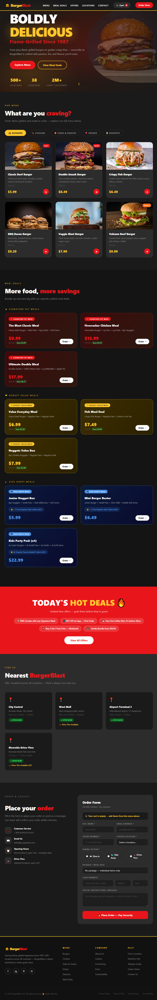

# BurgerBlast

> Taste the Fire — a fast-food chain website.

Live site: [verwertung777.github.io/burgerblast](https://verwertung777.github.io/burgerblast)

## Preview



## About

Single-page marketing site for the fictional BurgerBlast fast-food brand. Built as a single self-contained `index.html` file with no dependencies or build step.

**Features:**
- Tabbed menu (Burgers, Chicken, Sides, Drinks, Desserts)
- Meal deal cards (Signature, Value, Kids)
- Deals & promotions banner
- Store locations section
- Order/contact form (submits to email via FormSubmit)
- Cart sidebar with localStorage persistence
- Fully responsive

## Running locally

Open `index.html` directly in a browser, or serve it:

```bash
npx serve .
```

## Deploy

Pushes to `main` automatically deploy to GitHub Pages via the included Actions workflow.
